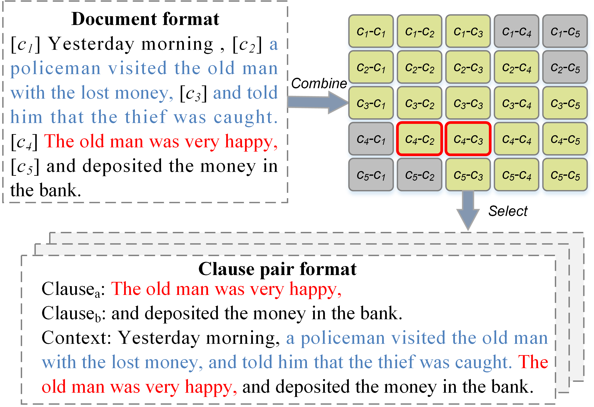

# Emotion-Cause Relationship Between Clauses Prediction: a Novel Method Based on BERT for Emotion-Cause Pair Extraction

This repo provides the source code and data for the paper [Emotion-Cause Relationship Between Clauses Prediction: a Novel Method Based on BERT for Emotion-Cause Pair Extraction]() (2022).


<p align="center">
  
</p>

## Requirements

- Python == 3.8.5
- PyTorch == 1.7.0
- transformers == 4.5.1

##  Usage
1. Origianl data can be download from [this link](https://github.com/Determined22/Rank-Emotion-Cause). And put it to the fold `data`
2. Download the pertrained ["BERT-Base, Chinese"](https://github.com/google-research/bert) model from [this link](https://s3.amazonaws.com/models.huggingface.co/bert/bert-base-chinese.tar.gz). And put it to the folder `src/bert-base-chinese`.
3. Construct data:

```
python src/utils/construct_data.py
```
You can change the variabl `rel_distance` to construct dataset with the corresponding relative distacne.

4. Training the model:

```
python src/main.py
```

5. Evaluate results:
```
python src/eval.py
```


##  Acknowledgment
This repo is built upon the following work: 
```
Effective Inter-Clause Modeling for End-to-End Emotion-Cause Pair Extraction
https://github.com/Determined22/Rank-Emotion-Cause
```

Many thanks to the authors and developers!

## Others
If this work is helpful, please cite as:
```bib

```
